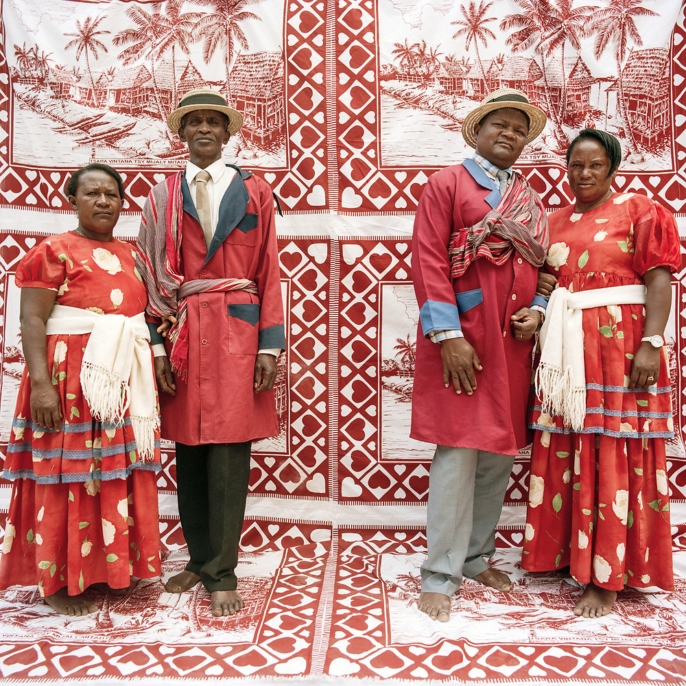
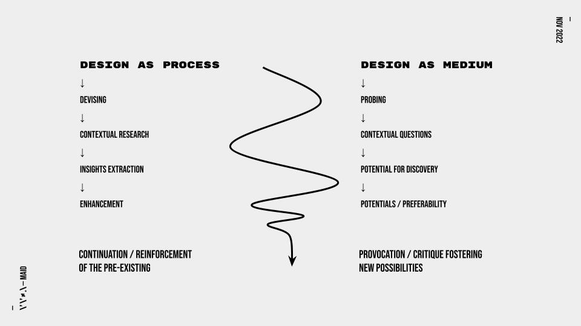

<section data-state=h1 >
 
    <h1 class="NT" style="font-family:'HND' !important;text-transform: uppercase !important;line-height: 0.9;font-size: 8rem !important;" >Design & Outer Space</h1>

<aside class="notes">
    - Hello, my name is Sitraka Rakotoniaina, 
    - I am an Artist, designer from Madagascar and currently living and working in London. 
    - I'm also an educator, I am a lecturer at Central Saint Martins, in the MA Narrative Environments and Industrial Design courses. I'm also an Associate Lecturer in the MA Fashion Futures at London College of Fashion, and I also lecture at Goldsmiths University in the MA Expanded Practice. 
    - And I'm currently doing a PhD in design at the University Of The Arts London. 
  </aside>
</section>

<section data-background-image="assets/imgs/pp2.jpg" data-state=prop>
    
    <h1 class="NT" style="font-family:'HND' !important;text-transform: uppercase !important;line-height: 0.9;font-size: 17rem !important;" >\' \' ≠ .\</h1>
    <aside class="notes">
    - And beside my academic practice I also run a research and design studio called Very Very Far Away or VVFA 
    - and we specialise in object based interactions, where the type of work may vary from experiments 
  </aside>
</section>

<section data-background-image="assets/imgs/tc_arm.jpg" data-state=tc>
    
    <h1 class="NT" style="font-family:'HND' !important;text-transform: uppercase !important;line-height: 0.9;font-size: 17rem !important;" >\' \' ≠ .\</h1>
    <aside class="notes">
    - To devices
  </aside>
</section>

<section data-background-image="assets/imgs/pp4.jpg" data-state=prop>
 <h1 class="NT" style="font-family:'HND' !important;text-transform: uppercase !important;line-height: 0.9;font-size: 17rem !important;" >\' \' ≠ .\</h1>
<aside class="notes">
    - To installations
  </aside>
</section>

<section data-background-image="assets/imgs/eyefi2.jpg" data-state=eyefi>

 <h1 class="NT" style="font-family:'HND' !important;text-transform: uppercase !important;line-height: 0.9;font-size: 17rem !important;" >\' \' ≠ .\</h1>
<aside class="notes">
    - To specialised furniture
  </aside>
</section>

<!-- <section data-background-image="assets/imgs/mothership-landing_2.jpg" data-state=h2>
    
    <h1 class="NT" style="font-family:'grotesk' !important;text-transform: uppercase !important;line-height: 0.9;font-size: 8.2rem !important;" >Speculative Cosmologies</h1>
</section> -->

<section data-background-image="assets/imgs/cb2.jpg" data-state=cb1>
    
    <h1 class="NT" style="font-family:'Picnic' !important;text-transform: capitalize !important;line-height: 0.9;font-size: 6rem !important;" >i Design Poetics</h1>
    <aside class="notes">
    - Today, I want to discuss design’s role as a translator that turns ideas into tangible realities—and how this shapes the ways we may think and imagine outer space.   
    - And I think this matters because the stories we tell, the imaginaries we create, and the ideological projects we hold all seep into the objects and materials around us.   
    - And in turn, those materials shape how we see the world and imagine what’s possible, in this constant back-and-forth between ideas and things.
  </aside>
</section>

<section data-background-image="assets/imgs/cb2.jpg" data-state=cb1>
    The design process itself—beyond its final outcome—embodies and perpetuates power structures and ideologies. Through its functional, infrastructural, symbolic, and normative aspects, it establishes standards and normalises behaviours and practices.
    <aside class="notes">
    - Much like metaphors and language can create "pictures" or conceptual frameworks that constrain thinking, design functions as both an instrument and an infrastructure that shapes our aesthetic relations to the world.   
    - And by aesthetic, I don’t mean just what we may find visually pleasing—I mean the ways we perceive, sense, and experience the world around us.  
    - In essence, design is both a product of worldviews—reflecting existing ideologies—and a tool that frames and narrows or possibly broadens how people construct new ones. 
  </aside>
</section>

<section data-background-image="assets/imgs/cb2.jpg" data-state=cb1>
    Design serves as both an instrument of control and a force that shapes what is considered <em>natural or inevitable.</em>
    <aside class="notes">
    - And this duality allows design to both reinforce or challenge, enhance or disrupt existing perspectives.  
    - So obviously design is never neutral. Every object, system, and interface carries with it the values, ideologies, and intentions of its creators. It is both an instrument of control and a force that shapes what we come to see as natural or inevitable.   
    - And once again my work explores this duality, focusing on how it mediates our understanding of the world, particularly when we extend our imaginations to outer space.
  </aside>
</section>

<section data-background-image="assets/imgs/rm.jpg" data-state=rm>
 
 <h1 class="NT" style="font-family:'Picnic' !important;text-transform: capitalize !important;line-height: 0.9;font-size: 6rem !important;" >Design As Control</h1>
 <aside class="notes">
    - But before diving into some of my own work and approaches, I want to briefly highlight a few dimensions through which design manifests this duality using a couple of examples.   
    - Each example embodies this tension: design as both an active force in shaping social, cultural, and political realities, and as a system that makes those realities seem inevitable or natural.
  </aside>
</section>

<section data-background-image="assets/imgs/mosesbeamjpg" data-state=rmb>
 
 <!-- Objects, designs, and technologies embody and enforce social values, biases, and power dynamics;  Artefacts have politics, and these politics permeate through everyday practices and material cultures. -->
 <aside class="notes">
    - Robert Moses (1888–1981), a key figure in urban planning in New York from the 1930s to the 1960s, exemplifies how design choices can enforce social and political agendas. 
  </aside>
</section>

<section data-background-image="assets/imgs/rm_23.jpg" data-state=rm2>
 
 <!-- Objects, designs, and technologies embody and enforce social values, biases, and power dynamics;  Artefacts have politics, and these politics permeate through everyday practices and material cultures. -->
 <aside class="notes">
    - he's known for designing low-hanging overpasses on parkways to Long Island beaches, his work prevented buses—and therefore lower-income and minority communities—from accessing these public spaces.   
    - So his urban planning decisions enforced social control by physically shaping who had access to certain spaces. At the same time, these designs made segregation feel like a natural consequence of infrastructure, rather than an intentional act of exclusion.
  </aside>
</section>

<section data-background-image="assets/imgs/cmen.jpg" data-state=cmen>
    
     <h1 class="NT" style="font-family:'Picnic' !important;text-transform: capitalize !important;line-height: 0.9;font-size: 6rem !important;" >Design As Cultural Mediation</h1>
    <aside class="notes">
    - The Codex Mendoza, created around 1541 in Mexico, was intended to document Aztec life for the Spanish Crown. More than a historical record, it helped legitimise Spanish conquest by showing the Aztecs as an organised society that already paid tribute and followed complex systems of control. it detailed how the Aztec Empire collected tribute, managed labour, and maintained social order—making it easier for the Spanish to justify their own rule. It also highlighted the Aztecs' military conquests, framing Spanish colonisation as just another step in an ongoing cycle of power and control. 
  </aside>
</section>

<section data-background-image="assets/imgs/cmen.jpg" data-state=cmen>
    <aside class="notes">
    - the codex was used as propaganda to justify Spanish domination. While it documents Aztec culture, it does so through a distorted lens, reflecting how design can impose power while shaping cultural narratives.
  </aside>
</section>

<section data-background-image="assets/imgs/kkdam2.jpg" data-state=kkd>
 
 <h1 class="NT" style="font-family:'Picnic' !important;text-transform: capitalize !important;line-height: 0.9;font-size: 6rem !important;" >Artefacts As Agents</h1>
 <aside class="notes">
    - Every artefact, whether a chair, a city, or a spacecraft, participates in the shaping of societal values and power structures. And therefore indicate that design is inherently political.   
    - And ofcourse artefacts themselves have agency, influencing human behaviour and social structures beyond their intended use. 
  </aside>
</section>

<section data-background-image="assets/imgs/kkdam.jpg" data-state=kkd>
 <aside class="notes">
    - The Kajaki Dam, built in the 1950s with U.S. funding to modernise Afghanistan, is a clear example of this. It was meant to provide irrigation and hydroelectric power, but it flooded large areas of farmland, displacing many local farmers. The new irrigation systems often favoured larger landowners, leaving small farmers struggling. With few other options, many turned to growing poppies, as the improved irrigation made the land ideal for cultivating this resilient and highly profitable crop, fueling the opium trade. Here, the dam becomes an agent in the socio-political landscape, enabling unforeseen consequences and reshaping realities. This highlights design’s dual role—both enforcing political agendas and producing unintended societal impacts. The modernisation efforts reflected a Western gaze, imposing ideas of modernity onto a landscape and culture they barely understood. This shows how design is always political and shapes worldviews.
  </aside>
</section>

<section data-background-image="assets/imgs/sd.jpg" data-state=sd>
 
</section>

<section data-background-image="assets/imgs/kjk.jpg" data-state=kkd2>
 
 Designs do not exist in isolation; they operate within assemblages where artefacts, practices, and power relations converge, reinforcing or disrupting, reshaping and reconfiguring broader social structures.
</section>

<section data-background-image="assets/imgs/sa_0.jpg" data-state=sa>
 
</section>

<section data-background-image="assets/imgs/sa_1.jpg" data-state=sa2>
 
</section>

<section data-background-image="assets/imgs/apas.jpg" data-state=apas>
 
</section>

<section data-background-image="assets/imgs/apas89.jpg" data-state=apas89>
 
</section>

<section data-background-image="assets/imgs/apas952.jpg" data-state=apas95>
 
</section>

<section data-background-image="assets/imgs/apas9522.jpg" data-state=apas95>
Design itself is an assemblage, composed of interconnected elements—ideas, practices, technologies, and social norms—that operate within broader networks. It never stands alone but constantly interacts with larger systems, reinforcing or challenging the structures within which it exists.
</section>

<section data-background-image="assets/imgs/DD2.jpg" data-state=dd>
    
</section>

<section data-background-image="assets/imgs/pa.jpg" data-state=pa>
    
    Design approaches <em>[...]</em> are critical, activist, organic, and political; they are about thinkering (thinking with your hands, doing hands-on conceptual work), about problem finding and problem framing more than problem solving, and about functional social fictions rather than science fiction;
</section>

<section data-background-image="assets/imgs/artez_2.png" data-state=gh>
    
    <h1 class="NT" style="font-family:'Lithops' !important;text-transform: uppercase !important;line-height: 0.9;font-size: 11rem !important;" >Critical Making</h1>
</section>

<section data-background-image="assets/imgs/artez_2.png" data-state=mr>
    
    Critical making is an elision of two typically disconnected modes of engagement in the world—
</section>

<section data-background-image="assets/imgs/artez_2.png" data-state=mr>
    ‘Critical thinking,’ often considered as abstract, explicit, linguistically based, internal and cognitively individualistic;  and ‘making,’ typically understood as material, tacit, embodied, external and community-oriented.
</section>

<section data-background-image="assets/imgs/empathics_32.jpg" data-state=sw1>
    
    <h1 class="NT" style="font-family:'Picnic' !important;text-transform: capitalize !important;line-height: 0.9;font-size: 8rem !important;" >2. Design Poiesis</h1>
</section>

<section data-background-image="assets/imgs/stamp.jpg" data-state=kj1>
    
    By bringing ideas into existence, design constructs new meanings, realities, and experiences, literally spawning new worlds as it interacts with its environment—shaping societal norms, cultures, politics, technologies, identities, values, and cosmologies.
</section>

<section data-background-image="assets/imgs/mdrs.jpg" data-state=mdrs>
    
</section>

<section data-background-image="assets/imgs/elk.webp" data-state=elk>
    
</section>

<section data-background-image="assets/imgs/rg2.jpg" data-state=rg>
    
</section>

<section data-background-image="assets/imgs/rg3.jpg" data-state=rg2>
    
</section>

<section data-background-image="assets/imgs/pbd.webp" data-state=dv>
    
</section>

<section data-background-image="assets/imgs/pre3.png" data-state=pp>
    
</section>

<section data-background-image="assets/imgs/pre2.jpg" data-state=ppe>
    
</section>

<section data-background-image="assets/imgs/venera13.webp" data-state=ven>
    
</section>

<section data-background-image="assets/imgs/hiragasy_2.jpg" data-state=hg>
    
    <h1 class="NT" style="font-family:'grotesk' !important;text-transform: uppercase !important;line-height: 0.9;font-size: 7.9rem !important;" >Speculative Ethnographies</h1>
</section>

<section data-state=hgw>
    
    
</section>

<section data-background-image="assets/imgs/rg_dd.png" data-state=neny>
    
    <iframe width="1280" height="512" src="https://www.youtube.com/embed/DJj9cqAqpVc?si=-itL4n4OrdTX2ei4" title="YouTube video player" frameborder="0" allow="accelerometer; autoplay; clipboard-write; encrypted-media; gyroscope; picture-in-picture; web-share" referrerpolicy="strict-origin-when-cross-origin" allowfullscreen></iframe>
</section>

<section data-background-image="assets/imgs/kesh.jpg" data-state=kesh>
    
</section>

<section data-background-image="assets/imgs/kesh2.jpg" data-state=kesh>
</section>

<section data-background-image="assets/imgs/cs_22.png" data-state=cs>
    
    <h1 class="NT" style="font-family:'Picnic' !important;text-transform: capitalize !important;line-height: 0.9;font-size: 8rem !important;" >3. Speculative Cosmologies</h1>
</section>

<section data-background-image="assets/imgs/cs2.jpg" data-state=cs>
    Design is a medium that—by envisioning and materialising alternative ontologies and worldviews—reshapes our understandings of realities and our place within them.
</section>

<section data-background-image="assets/imgs/grec.jpg" data-state=gr>
    
    At the intersection of anthropology, ethnography, and speculative fiction, it embodies worlds we may hope for or caution against, with the potential of challenging existing narratives and expanding the boundaries of our imaginaries.
</section>

<section data-background-image="assets/imgs/ggrr.png" data-state=gr>
    <h1 class="BT" style="text-align: center !important;">Crafting Worlds From Within</h1>
</section>

<section data-state=h1>
    <h1 class="WP">IMAGINING OBJECTS, ARTEFACTS, RITUALS AND THINGS EMBODYING THE WORLD WITHIN WHICH THESE THINGS EXIST.</h1>
</section>

<section data-background-color="white" data-state=rev>
     
    <h1 class="WP" style="color:#171717">REVERSE ARCHAELOGY</h1>
</section>

<section data-state=tvoeil>

    <iframe width="700" height="500" src="https://www.youtube.com/embed/ZKfOcR7Qbu4?si=PY1-X-VjGGxpOJds" title="YouTube video player" frameborder="0" allow="accelerometer; autoplay; clipboard-write; encrypted-media; gyroscope; picture-in-picture; web-share" referrerpolicy="strict-origin-when-cross-origin" allowfullscreen></iframe>
</section>

<section data-state=mad>

    <iframe width="700" height="500" src="https://www.youtube.com/embed/Z0lArfzw59c?si=ygsn0G2ROT8yxRpn" title="YouTube video player" frameborder="0" allow="accelerometer; autoplay; clipboard-write; encrypted-media; gyroscope; picture-in-picture; web-share" referrerpolicy="strict-origin-when-cross-origin" allowfullscreen></iframe>
</section>

<section data-background-image="assets/imgs/wfrr.jpg" data-state=wfrr>

</section>

<section data-background-image="assets/imgs/monrail.jpg" data-state=header17>

</section>

<section data-background-image="assets/imgs/pokeys.jpg" data-state=header18>

</section>

<section data-state=noidea >
    
    
</section>

<section data-background-image="assets/imgs/traffic.jpg" data-state=header20>

</section>

<section data-background-image="assets/imgs/boring.png" data-state=header21>

</section>

<section data-state=header19 data-background-color="white">
    
    
</section>

<section data-background-image="assets/imgs/BIY_posters_d.png" data-state=auto>

    <h1 class="NT" style="font-family:'Picnic' !important;text-transform: capitalize !important;line-height: 0.9;font-size: 8rem !important;" >4. Critical Fables</h1>
</section>

<section data-state=cos>
    
    
</section>

<section data-state=header2>
    
    <iframe width="1080" height="512" src="https://www.youtube.com/embed/lkRSJQHlAR0?si=rPOE144y3aAFSK9E&amp;controls=0" title="YouTube video player" frameborder="0" allow="accelerometer; autoplay; clipboard-write; encrypted-media; gyroscope; picture-in-picture; web-share" referrerpolicy="strict-origin-when-cross-origin" allowfullscreen></iframe>
</section>

<section data-state=ik>
    
    <iframe width="1080" height="512" src="https://www.youtube.com/embed/60uAhggLGOM?si=kkXBncU7AbfT4hqk&amp;controls=0" title="YouTube video player" frameborder="0" allow="accelerometer; autoplay; clipboard-write; encrypted-media; gyroscope; picture-in-picture; web-share" referrerpolicy="strict-origin-when-cross-origin" allowfullscreen></iframe>
</section>

<section data-background-image="assets/imgs/arnem_1.jpg" data-state=arnem>
    
</section>
<section data-background-image="assets/imgs/arnem_2.jpg" data-state=arnem>
</section>

<section data-state=arnem>
    <iframe width="1080" height="512" src="https://www.youtube.com/embed/zEqr0jKqxMY?si=siywqlQqY57XRCKE&amp;controls=0&amp;start=2" title="YouTube video player" frameborder="0" allow="accelerometer; autoplay; clipboard-write; encrypted-media; gyroscope; picture-in-picture; web-share" referrerpolicy="strict-origin-when-cross-origin" allowfullscreen></iframe>
</section>

<section data-background-image="assets/imgs/ltm_d.png" data-state=ltm>

    <h1 class="NT" style="font-family:'Picnic' !important;text-transform: capitalize !important;line-height: 0.9;font-size: 8rem !important;" >5. Learning To Moonwalk</h1>
</section>

<section data-state=ltm_f>
    
    <iframe width="1080" height="512" src="https://www.youtube.com/embed/UWeQ13KR6e8?si=DJ4UPUkAKfkiMzSa" title="YouTube video player" frameborder="0" allow="accelerometer; autoplay; clipboard-write; encrypted-media; gyroscope; picture-in-picture; web-share" referrerpolicy="strict-origin-when-cross-origin" allowfullscreen></iframe>
</section>

<section data-state=jg>
    <h1 class="NT" style="font-family:'HND' !important;text-transform: uppercase !important;line-height: 0.4;font-size: 8rem !important;" >THANK YOU @sitraka___ / sitraka@vvfa.space</h1>
</section>